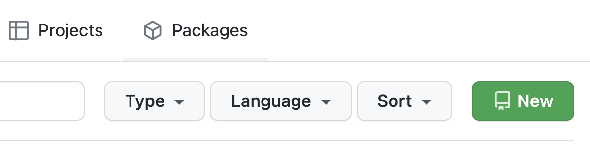
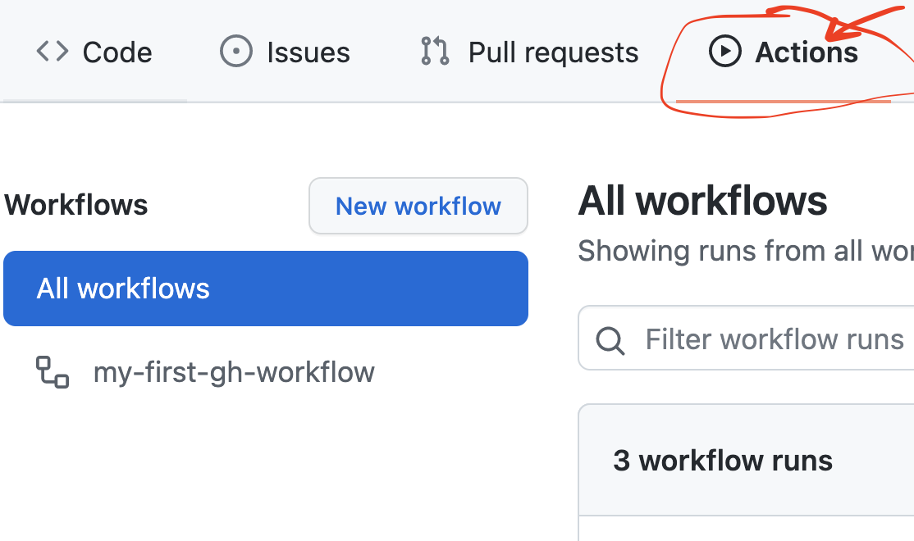
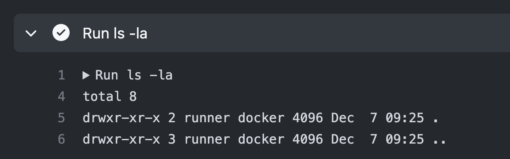
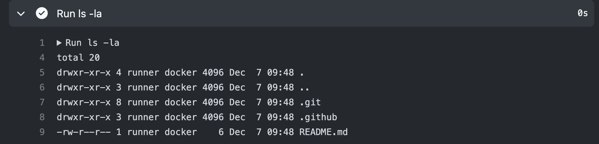

# Introduction to Github Actions


---

## Intro

GitHub Actions is a continuous integration and continuous delivery (CI/CD) platform that allows you to automate your build, test, and deployment pipeline. You can create workflows that build and test every pull request to your repository, or deploy merged pull requests to production.

GitHub provides Linux, Windows, and macOS virtual machines to run your workflows, or you can host your own **self-hosted** runners in your own data center or cloud infrastructure.

---
## Basic Abstractions

A GitHub Actions **workflow** is triggered when an *event* occurs in your repository.

A workflow contains one or more **jobs** which can run in sequential order or in parallel. 

Each job will run inside its own virtual machine **runner**, or inside a container, and has one or more **steps** that either run a script that you define or an **action** - a reusable extension that can simplify in your workflow.


---
## Workflows
A workflow is a configurable automated process that will run one or more **jobs**. 

- defined by a YAML file checked in to your repository
- triggered by an event in your repository
- can be alson triggered manually
- can be scheduled

A repository can have multiple workflows

---

## Workflows

Lives in an <*your_repository_url*>/.github/workflows/*.yaml file:

```yaml
name: learn-github-actions  # workflow name
on: [push]                  # triggering event
jobs:                       # list of jobs
  my-first-job:             #job name
    steps:                  #list of steps
      - run: echo Hello Github Actions  #step definition
```
---

## Jobs

A job is a set of steps in a workflow that execute on the same *runner*.

Each step is either a shell script that will be executed, or an action that will be run. 

Steps are executed in order and are dependent on each other. 

You can share data from one step to another. 

For example, you can have a step that builds your application followed by a step that tests the application that was built.

---

## Jobs

Here's a job with 2 steps:

```yaml
jobs:
  example:
    steps:
      - uses: actions/checkout@v2 #this is an action step - it checks ot the code
        with:
          ref: my-branch
      - run: echo This is a shell script step
```
---

## Actions

- Custom applications for the GitHub Actions platform
- Perform complex but frequently repeated task.
- Use actions to help reduce the amount of repetitive code.
- Examples of actions:
    - [actions/checkout@v](https://github.com/marketplace/actions/checkout) : pull your git repository from GitHub
    - [actions/setup-python@v2](https://github.com/marketplace/actions/setup-python): set up the correct toolchain for your build environment
    - [google-github-actions/auth@v0.4.1'](https://github.com/marketplace/actions/authenticate-to-google-cloud) : set up the authentication to your cloud provider.

You can write your own actions, or you can find actions to use in your workflows in the GitHub Marketplace.

---
## Actions

Here's how to use an action in a step to set up a Node.js environment:

```yaml
jobs:
  build_node_app:
    runs-on: ubuntu-latest
    steps:
    ..
    - uses: actions/setup-node@v2
        with:
          node-version: '16'
```

---
## Runners


A runner is a server that runs your workflows when they're triggered. 

Each runner can run a single job at a time. 


GitHub provides Ubuntu Linux, Microsoft Windows, and macOS runners.

Each workflow run executes in a fresh, newly-provisioned virtual machine. 

If you need a different operating system or require a specific hardware configuration, you can host your own runners. For information on self-hosted runners, see ["Hosting your own runners."](https://docs.github.com/en/actions/hosting-your-own-runners)

---


## Runners

Here's how to use an action in a step to set up a Node.js environment:

```yaml
jobs:
  build_node_app:
    runs-on: ubuntu-latest   # <- **This defines a runner**
    steps:
    ..
    - uses: actions/setup-node@v2
        with:
          node-version: '16'
```

---

## Let's get our hands dirty!

- Create a new repository - call it **'otomato-actions'**:


---
## Our first workflow

- Create a file: .github/workflows/hello.yaml

- In the file put the following:

```yaml
name: my-first-gh-workflow  # workflow name
on: [push]                  # triggering event
jobs:                       # list of jobs
  say-hello:             #job name
    runs-on: ubuntu-latest
    steps:                  #list of steps
      - run: echo Hello Github Actions  #step definition
```
---

## Check the action execution

Go to 'Actions' in Github UI:


---

## Exercise:

- Add a README.md file to your repository root folder with content:

```
# This is an Otomato Github Actions Workshop
```

- Check that there's a new Actions execution happening when you commit the file.

---

## Job - the working-directory

Each job runs in a working directory on a runnner.

The repository code isn't in this directory by default - it needs to be explicitly checked out.

Explore the working directory in your workflow:
```yaml
name: my-first-gh-workflow  # workflow name
on: [push]                  # triggering event
jobs:                       # list of jobs
  say-hello:             #job name
    runs-on: ubuntu-latest
    steps:                  #list of steps
      - run: echo Hello Github Actions  #step definition
      - run: pwd #where are we?
      - run: ls -la #let's look around
```
---

## There's nothing here:


---

## Let's check out our code:

- Edit hello.yaml to look like this:

```yaml
name: my-first-gh-workflow  
on: [push]                  
jobs:                      
  say-hello:            
    runs-on: ubuntu-latest
    steps:                  
      - run: echo Hello Github Actions 
      - uses: actions/checkout@v2  # <- Add this line!!!
      - run: pwd 
      - run: ls -la
```
---

## Check the Results:

Now we're talking!



---

## Naming our steps

It's a good practice to provide clear names for your steps, describing what it is they are meant to do.

```yaml
    steps:                  
      - name: Say Hello 
        run: echo Hello Github Actions 
      - name: Next step
        ...
```
---

## Exercise

- Add names to the steps in hello.yaml

- Commit your changes and check how workflow visualization changes in Action view

    > Side note: the order of the fields within a step doesn't matter. 
    > This will also work:
    > ```yaml
    > - run: ls -la
    >   name: Look around
    > ```
---

## Defining Environment

Often we need to set environment variables when we call commands and run processes in our workflow.

Environment variables can be set on workflow, job or step level:

```yaml
name: Hello with env 
on: [push]                  
env:
  COMPANY: Otomato
jobs:                       
  say-hello-with-env:             
    runs-on: ubuntu-latest
    env:
      SUBJECT: GithubActions
    steps:
      - name: Say hello
        run: echo "Hello ${NAME}. Today we're learning ${SUBJECT} with ${COMPANY}."
        env: 
          NAME: Octocat
```
---

## Exercise

- Add another workflow file called hello-env.yaml to your repository with the content from previous slide.

- Check the execution results.

---

## Using Environment in Actions

For `run` steps we can use the OS mechanism for injecting the environment. in order to use this with actions or workflow conditionals (discussed later) we need to access it through the `env` context:
```yaml
steps:
  - name: Install Python
    - uses: actions/setup-python@v2
      with:
        python-version: ${{ env.PYTHON_VERSION }}
```

---

## Built-in Environment Variables

GitHub sets some default environment variables for actions to use in all runner environments.

Examples:
|Variable|Description|
|--------|:---------:|
|GITHUB_WORKFLOW| The name of the workflow |
|GITHUB_SHA |	The commit SHA that triggered the workflow. |
|GITHUB_WORKSPACE| The GitHub workspace directory path |

All available variables can be found [here](https://docs.github.com/en/actions/learn-github-actions/environment-variables#default-environment-variables)

---

## Triggers

You can configure workflows to run for one or more events using the `on` workflow syntax:

Single event:
```
# Triggered when code is pushed to any branch in a repository
on: push
```

Multiple events:
```
# Triggers the workflow on push or pull request events
on: [push, pull_request]
```

With configuration:
```yaml
on:
  # Trigger the workflow on push but only for the main branch
  push:
    branches:
      - main
```
---
## Scheduled Triggers

You can define the schedule for workflow triggering using *cron* syntax:
```yaml
on:
  schedule:
    # * is a special character in YAML so you have to quote this string
    - cron:  '30 5,17 * * *'
```

You can use [crontab guru](https://crontab.guru/) to help generate your cron syntax and confirm what time it will run. To help you get started, there is also a list of [crontab guru examples](https://crontab.guru/examples.html).

(Scheduled workflows run on the latest commit on the default or base branch. The shortest interval you can run scheduled workflows is once every 5 minutes.)

---
## Exercise

- Change your "Hello with env" workflow to run every 5 minutes no matter what events occur in the repository.

- Change "my-first-gh-workflow" to only get triggered on pushes to "main" branch

- Check out a new branch called "feature/one" 

- Verify no action is triggered when changes are pushed to the feature branch.

- Check if you scheduled trigger is working

---

## Manual Trigger

You can manually trigger workflow runs. To trigger specific workflows in a repository, use the `workflow_dispatch` event. 

```yaml
on: workflow_dispatch
```

You can configure custom-defined input properties, default input values, and required inputs for the event directly in your workflow. When the workflow runs, you can access the input values in the `github.event.inputs` context. 

---

## Manual Trigger with Inputs
```yaml
name: Manually triggered workflow
on:
  workflow_dispatch:
    inputs:
      name:
        description: 'Person to greet'
        required: true
        default: 'Mona the Octocat'
      home:
        description: 'location'
        required: false
        default: 'The Octoverse'

jobs:
  say_hello:
    runs-on: ubuntu-latest
    steps:
      - run: |
          echo "Hello ${{ github.event.inputs.name }}!"
          echo "- in ${{ github.event.inputs.home }}!"
```

---

## Exercise

Add a workflow to your repo that will be:

- Triggered manually

- Will receive one input: **node_version** with default version "15"

- Will have a job with 2 steps:
    -  'actions/setup-node@v2' action to install nodejs with user-defined version
        - Use `with: node_version` as shown [here](https://github.com/actions/setup-node#:~:text=setup%2Dnode%40v2-,with%3A%0A%20%20%20%20node%2Dversion%3A%20%2714%27,-%2D%20run%3A%20npm%20install)

    -  run `node --version` to verify the installed node version

---

## Conditional Execution

We can use  the `if` conditional to prevent a job (or step) from running unless a condition is met. 

We can use any supported *context* and *expression* to create a conditional.

```yaml
jobs:
  only-run-on-feature-branch:
    runs-on: ubuntu-latest
    if: contains(github.ref, 'feature')
    steps:
    ...
```

---

## Conditional Execution

With steps:

```yaml
steps:
  - name: Only features
    if: contains(github.ref, 'feature')
    run: echo $GITHUB_REF
```

---

## Exercise:

- Add a job to your manual workflow that will only run on branches with 'patch' in their name

- In the job run a step to echo the git hash


